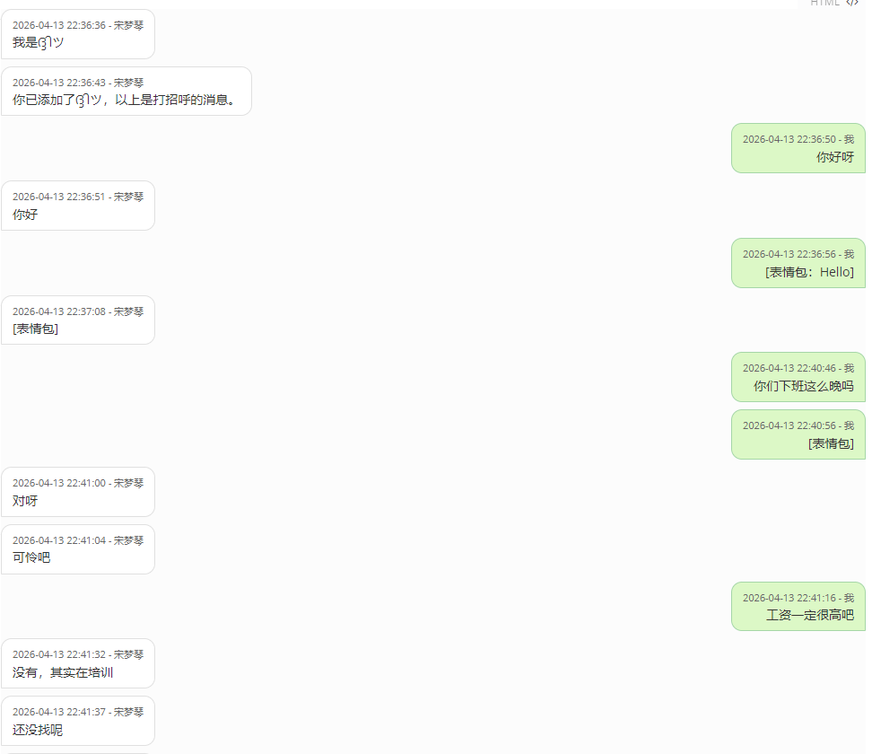

# 聊天记录转换工具

TXT-to-md 是一个简单易用的聊天记录转换工具，可以将TXT格式的聊天记录转换为美观的Markdown格式文件，支持自动分片和美观的样式展示。

## ✨ 功能特性

- 📝 **自动格式转换**：将TXT聊天记录转换为Markdown格式
- 🎨 **美观样式**：使用不同颜色和样式区分发送者和接收者消息
- 📊 **自动分片**：每4000条消息自动生成一个新的MD文件，避免单个文件过大
- 🖼️ **特殊内容支持**：支持图片、视频、语音、文件等特殊内容的标识
- 📱 **响应式设计**：生成的Markdown在各种设备上都有良好的显示效果
- 🚀 **跨平台**：支持Windows、macOS、Linux系统

## 📋 输入格式要求

工具支持的TXT聊天记录格式：

```
2023-12-01 10:30:25 '张三'
这是张三发送的消息内容
可以跨多行

2023-12-01 10:31:15 '我'
这是我的回复
也可以跨多行
```

**格式说明：**
- 每条消息以时间戳和用户名开始，格式：`YYYY-MM-DD HH:MM:SS '用户名'`
- 时间戳和用户名需要用单引号包围
- 消息内容可以跨多行
- 空行作为消息分隔符

## 🎯 输出效果

生成的Markdown文件包含：

- 📄 **标题**：使用原始TXT文件名作为文档标题
- 📅 **生成时间**：显示转换完成的时间
- 💬 **消息样式**：
  - 我的消息：绿色背景，右对齐
  - 他人消息：白色背景，左对齐
  - 时间戳：灰色小字体显示
- 📱 **响应式布局**：适配不同屏幕尺寸



## 🚀 使用方法

### 方法一：使用可执行文件（推荐）

1. 下载 `main.exe` 文件
2. 将需要转换的TXT文件放在与`main.exe`相同的目录下
3. 双击运行 `main.exe`
4. 程序会自动处理所有TXT文件并生成对应的MD文件

### 方法二：使用Python源码

```bash
# 安装依赖（如果需要）
python -m pip install -r requirements.txt

# 运行程序
python main.py
```

### 方法三：使用PyInstaller打包

```bash
# 打包为可执行文件
pyinstaller main.spec
```

## 📁 文件结构

```
聊天记录转换工具/
├── main.py              # 主程序文件
├── TXT-to-md.exe            # 可执行文件（打包后）
├── README.md           # 说明文档
├── example.txt         # 示例输入文件（可选）
```

## ⚙️ 配置说明

### 消息分片设置
- **默认分片大小**：4000条消息
- **文件名规则**：
  - 主文件：`原文件名.md`
  - 分片文件：`原文件名_part2.md`、`原文件名_part3.md`等

### 样式自定义
如果需要自定义输出样式，可以修改以下代码部分：

- **消息样式**：`main.py`第38-68行的CSS样式
- **页面布局**：`main.py`第83-93行的HTML头部
- **颜色主题**：
  - 我的消息：`#DCF8C6`（浅绿色）
  - 他人消息：`#FFFFFF`（白色）

## 🔧 开发说明

### 环境要求
- Python 3.6+
- 无需额外依赖库

### 主要类和方法

#### ChatRecordConverter 类
- `parse_message(line)` - 解析单行消息
- `convert_message_to_markdown_simple()` - 转换为Markdown格式
- `convert_txt_to_markdown()` - 转换整个TXT文件
- `process_directory()` - 处理目录下的所有TXT文件

### 正则表达式
```python
# 消息解析正则表达式
message_pattern = re.compile(r'^(\d{4}-\d{2}-\d{2} \d{2}:\d{2}:\d{2}) \'(.+?)\''$')
```

## 📝 使用示例

### 输入文件 (chat.txt)
```
2023-12-01 10:30:25 '张三'
你好，今天天气不错

2023-12-01 10:31:15 '我'
是的，很适合出去走走

2023-12-01 10:32:00 '张三'
[图片]
```

### 输出文件 (chat.md)
```markdown
# chat

<div style="font-family: -apple-system, BlinkMacSystemFont, 'Segoe UI', Roboto, sans-serif;
            max-width: 800px; margin: 0 auto; padding: 15px;">

<p style="text-align: center; color: #666; font-size: 12px; margin-bottom: 20px;">
    聊天记录生成时间: 2023-12-01 14:30:00
</p>

<div style="text-align: left; margin: 8px 0; clear: both;">
    <div style="display: inline-block; max-width: 70%; background: #FFFFFF;
                border-radius: 12px 12px 12px 0; padding: 8px 12px;
                border: 1px solid #E0E0E0;">
        <div style="font-size: 11px; color: #666; margin-bottom: 2px;">2023-12-01 10:30:25 - 张三</div>
        <div style="font-size: 14px; line-height: 1.3;">你好，今天天气不错</div>
    </div>
</div>

<div style="text-align: right; margin: 8px 0; clear: both;">
    <div style="display: inline-block; max-width: 70%; background: #DCF8C6;
                border-radius: 12px 12px 0 12px; padding: 8px 12px;
                border: 1px solid #A5D6A7;">
        <div style="font-size: 11px; color: #666; margin-bottom: 2px;">2023-12-01 10:31:15 - 我</div>
        <div style="font-size: 14px; line-height: 1.3;">是的，很适合出去走走</div>
    </div>
</div>

</div>
```

## 🐛 常见问题

### Q: 转换失败怎么办？
A: 请检查TXT文件格式是否符合要求，确保时间戳格式正确且用户名用单引号包围。

### Q: 支持哪些特殊内容？
A: 目前支持 `[图片]`、`[视频]`、`[语音]`、`[文件]` 等特殊内容的标识。

### Q: 生成的文件太大怎么办？
A: 程序会自动将超过4000条消息的文件分割成多个文件，每个文件最多包含4000条消息。

### Q: 可以自定义样式吗？
A: 可以，修改 `main.py` 中的CSS样式部分即可自定义输出样式。

## 📄 许可证

MIT License

## 🤝 贡献指南

欢迎提交Issue和Pull Request来改进这个工具！

## 更新日志
 
### v1.0.0    ----2026.4.18
- 初始版本发布，支持基本的TXT到Markdown转换功能